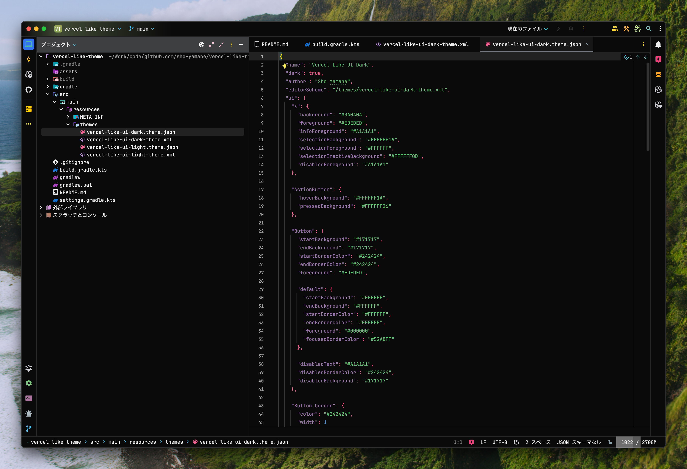
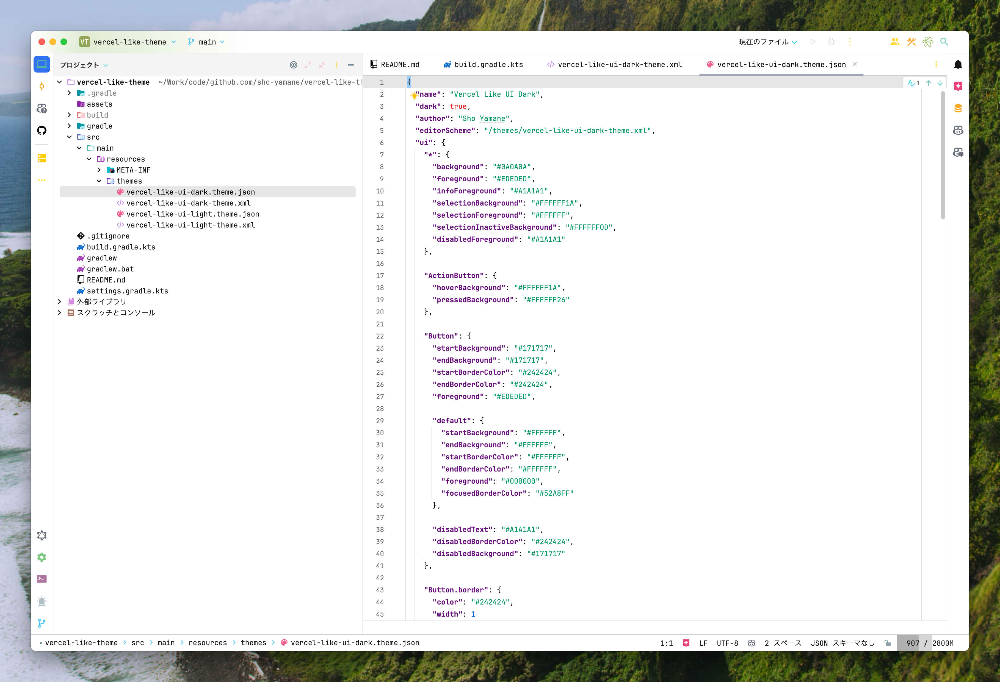

# Vercel Like UI Theme for IntelliJ-based IDEs

A Vercel-like UI theme for IntelliJ-based IDEs, supporting both dark and light modes.

## Screenshots

### Dark Theme

### Light Theme

## Features

- Color scheme based on Vercel's design system
- Support for both dark and light modes
- Color combinations optimized for readability
- Optimized for major programming languages

## Installation

1. Open IntelliJ IDEA Settings/Preferences
2. Go to Plugins → Marketplace
3. Search for "Vercel Like UI"
4. Click Install
5. Restart your IDE

## Usage

1. Go to Settings/Preferences → Appearance & Behavior → Appearance
2. Select "Vercel Like UI Dark" or "Vercel Like UI Light" from the Theme dropdown
3. Click Apply

## Contributing

For bug reports and feature requests, please create an [Issue](https://github.com/sho-yamane/intellij-vercel-like-ui/issues).

## Credits

This theme is inspired by [VSCode Vercel Theme](https://github.com/gantoreno/vscode-vercel). Special thanks to [@gantoreno](https://github.com/gantoreno) for creating such an amazing theme.

## License

MIT License

## Author

Sho Yamane ([@sho-yamane](https://github.com/sho-yamane))
